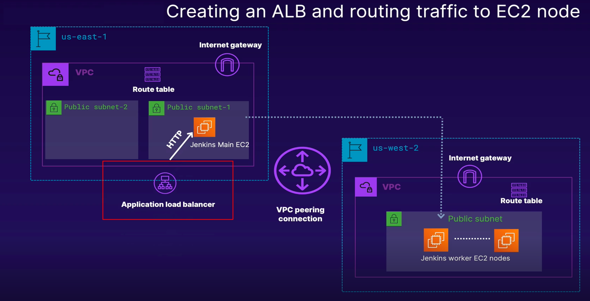

# Description

You are recently hired as an Infrastructure Automation Engineer at a SaaS company. The company is trying to move away from cloud-provider-specific infrastructure as code. They want to test out Terraform for infrastructure deployment as it is cloud agnostic and Ansible as it is OS agnostic and also a hybrid IaC tool.

Your first task is to use Terraform and Ansible to deploy a distributed Jenkins CI/CD pipeline and put it behind one of the company's DNS domains for testing. It sounds easy enough but there's quite some planning which will go into this and you're already on top of it.
# Multi-Region_Jenkins_CI-CD_Dep_Ansible-Terraform

I compared and contrasted Terraform, Ansible, and Terraform in this project as I gear up for diving into this project to use all of these infrastructure-as-code technologies.

In this project, I went through a brief summary of what I did building as an end result of this goal, and how those individual units of infrastructure were going to be connected and deployed via Ansible and Terraform.

# Setting Up the Environment

I was set up the generally available Terraform binary. As of this recording, the version is 0.12.29. In this project is based on a CentOS 7 system.

Resources:\
Terraform 0.12.29 Binary Linux

I build on setting up the system so that it has the required software installed for following along in this project. I installed Ansible and AWS CLI using Python's Pip package manager. I used a CentOS 7 system as a base for running Terraform deployments throughout the project.

Note: Terraform used for utilizing the credentials for communicating with AWS via the AWS CLI that set up in this part. I had been issuing the following command, once I installed the AWS CLI utility to save the credentials for AWS locally on the system. Terraform was been using these credentials to carry out API calls to AWS in the backend:

$ aws configure

I had been prompted to enter an AWS Access Key ID and a AWS Secret Access Key ID as well as default region(enter us-east-1) and default output for API call outputs(enter json). This was then save the credentials in the 

$ ~/.aws/credentials 

file.

Resources:\
ansible.cfg

In this part, I described how to allow Terraform to deploy resources in AWS using IAM policies.

At the least, I needed IAM permissions described by the IAM policy available in the resource section of this part. I could then do one of the following:

Create an EC2 role and attach an instance profile to an EC2 instance to work within AWS.
Attach the IAM policy directly to an IAM user created for this deployment and configure AWS CLI with it's credentials to allow Terraform permissions to deploy in AWS.

Resources:\
terraform_deployment_iam_policy.json\
terraform_deployment_lax_iam_policy.json
# Terraform Infrastructure as Code (IaC)

In the context of this project, I created multiple providers so that I can deploy resources in more than one AWS region.

I had been laying down the network foundation for our CI/CD project in this part. I had been deploying VPCs, subnets, and IGWs in two separate regions using the multiple providers I created earlier in the project. At the end, I had tested my Terraform code for consistency and syntax, then deployed it using terraform apply.

Resources:\
network_setup_1.tf

I continued building on the network part of my deployment. I first built a VPC peering connection between the two VPCs in separate regions and then proceeded to manipulate VPC route tables so that both VPCs can communicate over the VPC peering connection.  

Resources:\
network_setup_2.tf

I went through the layout of security groups and also demonstrate them.  

Resources:\
network_setup_3.tf

I leveraged the power of Systems Manager (SSM) public parameter store to fetch AMI IDs in Terraform. I used these fetched AMI IDs later to spin up EC2 instances which would hosted our Jenkins application.

Resources:\
instances.tf\
ssm_resource_path_string.txt

I run through generating an SSH key pair and used it to create EC2 key pairs. I did this using Terraform, so that later I could attach those EC2 key pairs to our application nodes and connect to them using SSH.

Resources:\
instances_2.tf

I had defined the resources for creating the EC2 instances which hosted our Jenkins master and Jenkins worker nodes in separate regions. I also defined outputs in Terraform to show the public IPs of these instances once terraform apply has run successfully. Finally I tested the EC2 keypairs that I had created in preceding part to SSH into our newly-created EC2 instances.  

Resources:\
instances_3.tf

In this part, I added Terraform provisioners to my EC2 instance resources and apply bootstrapping to the EC2 instances (for Jenkins Master and Worker nodes) via sample Ansible playbooks. I used Ansible dynamic inventory for AWS to keep track of instances as they were spun up and deleted. Later, I built customized Ansible playbooks for bootstrapping our Jenkins application installation and integration.  

Resources:\
tf_aws_ec2.yml\
master_provisioner.tf\
jenkins-master-sample.yml\
jenkins-worker-sample.yml

I went ahead with deploying an application load balancer which fronts an EC2 application node. In this lesson, I showed a sample Apache (HTTPD) webserver running on the EC2 instance in question.  

Resources:\
alb.tf\
jenkins-master-sample_2.yml

I went about deploying the HTTPS endpoint for my application. I did this by adding an HTTPS listener to the ALB I created in the previous part. I generated an SSL certificate to attach to the ALB HTTPS listener so that HTTPS traffic can be terminated at the ALB. I put a DNS domain in front of our load balancer and also enabled http to https redirection.

$ aws route53 list-hosted-zones

Look for Name under the HostedZone field in the output of the above command.  

Resources:\
dns.tf\
alb_2.tf\
alb_acm.tf\
outputs.tf

# Ansible Configuration Management

I was exclusively working on the Ansible playbook for setting up our Jenkins master/main node application. Afterwards I verified the syntax of the file using the syntax-check flag of ansible-playbook.

Note: For this project following along, please remember that this playbook expects that you have setup Ansible Dynamic inventory for EC2 (AWS) and the inventory configuration file from the following lesson:

Configuring Terraform Provisioners for Config Management via Ansible
The link to the playbook is in the resource section of this video.  

Resources:\
install_jenkins.yaml\

I created the Ansible playbook for Jenkins worker to run inside the Terraform provisioner. I briefly went over the logic and modules used to setup the Jenkins worker and checked it's syntax validity using the --synyax-check flag for the ansible-playbook command.

The link to the Jenkins worker playbook can be found in the resources section of this video.

Resources:\
install_worker.yaml

I learned about Jinja templating in Ansible and creating Jinja templates. I referenced these templates earlier in the Ansible playbook for the Jenkins worker node.

Links to download the two Jinja templates created in this part can be found in the resources so.  

Resources:\
node.j2 \
cred-privkey.j2
# Bringing It All Together

In this final, bring-it-all-together part, went through a checklist to make sure I did not missing any depedencies. I also modified the provisioners for the Jenkins master and worker nodes to pluged in the Ansible playbooks I wrote in previous part. In addition, we modify the ansible-playbook command in the Jenkins worker creation provisioner.

I fetched a public DNS domain hosted on Route 53 and copy it into the default variable I had been created earlier in the variables.tf file: dns-name.

I also changed the default value of the variable webserver-port to 8080 as Jenkins expects traffic from ALB on 8080.

Finally, I run terraform apply and use the URL returned as output of terraform apply to verify if the deployment was successful.

I loged into the application using the following credentials:

username: admin
password: password

With the Jenkins GUI, I could verify that the spun-up worker (in the variable.tf file by default) successfully integrated with the Jenkins master.

Note: For getting the DNS part to work, I need to provide a publicly routed domain.

I learned about the debugging environment variables available for both Ansible and Terraform, as well as the debugging flag available for Ansible. Later I went through guided demonstrations of how to invoke and use these debugging variables and what to expect in the output of verbose logs.